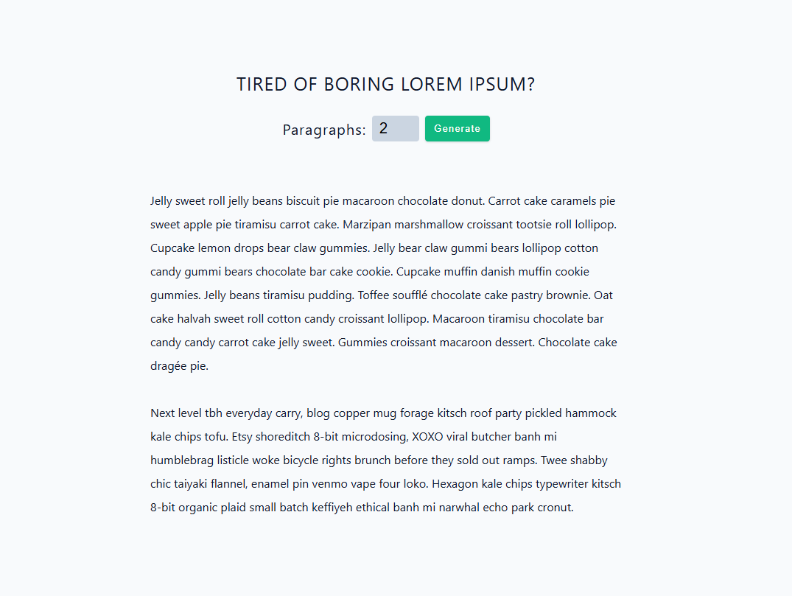

# Lorem Ipsum Generator

## Project Overview

This project is a **Lorem Ipsum text generator** built with React. It demonstrates the practical application of **controlled inputs** in React and how to manipulate data based on user input.

## Learning Objectives

The main focus of this project was to understand and implement:

- **Controlled Components**: Using React state to control form inputs and maintain a single source of truth
- **State Management**: Managing multiple state values (`count` for the input, `text` for the generated content)
- **Event Handling**: Handling form submissions and input changes to trigger data transformations
- **Data Manipulation**: Using array methods like `slice()` to dynamically extract and display data based on user input
- **Conditional Rendering**: Rendering lists of data dynamically using the `map()` method

## How It Works

1. The user sets a **number** (1-8) via a controlled number input
2. On form submission, the app **slices** the lorem ipsum text array to get the requested number of paragraphs
3. The selected paragraphs are **rendered dynamically** on the page

This simple flow showcases how controlled inputs drive the entire application logic—the form input controls the state, which then determines what data is displayed to the user.

## UI Screenshot

## Tech Stack

- **React** - UI library with hooks
- **Vite** - Build tool and dev server
- **nanoid** - Unique ID generation for list items
